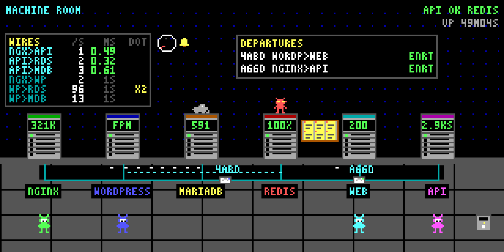

*This project has been created as part of the 42 curriculum by dlesieur.*

# Inception

<p align="center">
  
</p>
<p align="center"><sub>Two minutes of the lab's machine room, recorded from the running stack. <a href="#the-machine-room">Who's who</a></sub></p>

## Description

Inception is a system-administration project that builds a small, production-style web
infrastructure from scratch using **Docker Compose**. The goal is to understand how
containerised services are built, isolated, connected, and persisted — by writing every
Dockerfile by hand instead of pulling ready-made images.

The stack runs three services, each in its own dedicated container:

| Service | Role |
|---------|------|
| **NGINX** | TLS termination — the only entrypoint, port 443, TLSv1.2/1.3 only |
| **WordPress + php-fpm 8.4** | Application server (FastCGI, no web server inside) |
| **MariaDB 11.4** | Relational database (no web server inside) |

Key properties:

- All images are built locally from **`alpine:3.23`** — the *penultimate stable* Alpine
  release, as the subject requires. No service image is ever pulled.
- Persistent data (database + site files) lives in **Docker named volumes** stored under
  `/home/dlesieur/data` on the host.
- All credentials are delivered through **Docker secrets** — never hard-coded, never in
  environment variables, never committed to Git.
- The TLS certificate is issued by a **local CA on the host**; the CA private key never
  enters any container.
- The repository ships its own **compliance test suite** (`make test`) that maps
  one-to-one to the subject's rules, and **benchmarks** (`make bench`): a fresh clone
  reaches a live site in ~20s, a rebuilt stack in under 10s.

---

## Instructions

### Prerequisites

| Tool | Minimum version |
|------|----------------|
| Docker Engine | 24+ (25+ recommended for fast startup healthchecks) |
| Docker Compose (v2 plugin) | 2.20+ |
| GNU Make | 4+ |
| `openssl` (host) | secrets + TLS certificate generation |
| `sudo` access | for `/etc/hosts` and data-dir cleanup |

### Quick start

```bash
git clone <repo-url> inception && cd inception
make          # that's it — equivalent to `make up`
```

`make` runs a `setup` step that provisions everything that is missing, then builds and
starts the stack:

- creates the host data directories (`/home/dlesieur/data/{mariadb,wordpress}`)
- generates `srcs/.env` from `.env.example` (edit it to customise names/emails)
- generates **random passwords** into `secrets/` (never overwrites existing ones)
- adds `dlesieur.42.fr` to `/etc/hosts` if missing
- creates a local Root CA and issues the server certificate **on the host**
- builds the three Docker images and starts the stack

To use your own passwords instead of generated ones, create the files before `make`:

```bash
mkdir -p secrets
echo 'YourDbPass'      > secrets/db_password.txt
echo 'YourDbRootPass'  > secrets/db_root_password.txt
printf 'WpAdminPass\nWpEditorPass\n' > secrets/credentials.txt   # line 1 admin, line 2 editor
```

### Useful commands

| Command | Description |
|---------|-------------|
| `make up` | Provision + build images + start containers |
| `make down` | Stop & remove containers (data preserved) |
| `make restart` | Restart all services |
| `make logs` / `make status` | Follow logs / show container status |
| `make test` | Run the subject-compliance test suite (static + runtime) |
| `make test-deep` | Same + crash-restart and persistence tests |
| `make bench` / `make bench-full` | Build (+ boot) benchmarks |
| `make run_wp` | Full WordPress health report (versions, users, themes, DB) |
| `make trust` | Trust the local CA system-wide → clean padlock in browsers |
| `make clean` | Remove this project's containers, volumes, images & host data |
| `make fclean` | `clean` + full Docker system prune (machine-wide!) |
| `make re` | `clean` + `up` — full project rebuild, Docker build cache kept |

### Accessing the site

- **Site front-end:** `https://dlesieur.42.fr`
- **Admin panel:** `https://dlesieur.42.fr/wp-admin`
- **Bonus static site:** `http://dlesieur.42.fr:8090`

The certificate is issued by a local CA. Either accept the browser warning once, or run
`make trust` to install the CA into the system/browser trust stores.

---

## Bonus

All five permitted bonuses are implemented, plus two free-choice services that
share one purpose (the lab). Each is a separate container built
from its own Dockerfile on `alpine:3.23`, on the `inception` network, with a
healthcheck and `restart: unless-stopped` — the same rules as the mandatory
services.

| Service | What it is |
|---|---|
| **Redis object cache** | `bonus/redis/` — WordPress rebuilds the same options, posts and terms from MariaDB on every request. The `redis-cache` drop-in keeps them in memory instead. Configured as a cache and not a database: persistence off, `maxmemory 256mb`, `allkeys-lru` eviction. **No published port** — reachable only inside the docker network, because an unauthenticated cache must not be exposed. |
| **FTP server** | `bonus/ftp/` — vsftpd serving the WordPress site volume. The FTP account shares uid 65534 with `nobody`, which owns every file WordPress writes, so uploads land with correct ownership and no `chmod -R` is needed. Chrooted, passive-mode only, password from a Docker secret. |
| **Static website** | `bonus/staticsite/` — hand-written, dependency-free HTML/CSS/JS (no PHP, no framework, no CDN assets), served by its own nginx on port 8090. Fully independent of WordPress and MariaDB. |
| **Adminer** | `bonus/adminer/` — single-file database front end for MariaDB, pinned to a specific release **and its SHA-256**, served by PHP's built-in server (one process, PID 1 — the same approach as the official Adminer image). |
| **Scheduled database backups** *(free choice)* | `bonus/dbbackup/` — `mariadb-dump --single-transaction` on a cron schedule into its own named volume, with retention and a restore script. |
| **The lab: site + API** *(free choice)* | `bonus/web/` and `bonus/api/` — a keyboard-driven static site (Astro, rendered at build time, served by an unprivileged nginx) and a JSON API (Node, MariaDB as the source of truth, Redis for cache, counters and rate limits). Both are reached only through nginx, at `/lab/` and `/api/v1/`. See [DEV_DOC §13](DEV_DOC.md#13-the-lab-web--api-bonus-free-choice). |

### Why the backup service

The subject requires both volumes to live in `/home/<login>/data` on the host
precisely because **the data is the part that cannot be rebuilt**. Every other
container in this project can be recreated from its Dockerfile in seconds; the
database cannot be recreated from anything. Nothing else in the stack protects
it, so that is the gap this service fills.

It is deliberately more than a `cron` line:

- **`--single-transaction`** takes a consistent snapshot without locking tables,
  so the site keeps serving while the dump runs.
- **Writes to a `.part` file and renames on success**, so an interrupted run can
  never leave a truncated file that looks like a usable backup.
- **Verifies before keeping**: the dump must be non-empty and pass `gzip -t`.
- **Retention** prunes to the newest `BACKUP_KEEP`.
- **A restore path**, because a backup you cannot restore is not a backup:
  `docker exec dbbackup restore.sh`.
- The **healthcheck asserts a valid dump exists** — not merely that the process
  is running, which is how backup services are discovered to be broken on the
  day they are needed.

Demonstrable end to end: create a post → `backup.sh` → delete the post →
`restore.sh` → the post is back.

### Why the lab

The subject asks for infrastructure. The lab makes that infrastructure visible
and testable from a browser. `https://dlesieur.42.fr/lab/` draws the running
stack as a pixel-art machine room, and every light moves because the API reported
a real event: a cache hit, a slow query, a rate-limited write, a flight landing.
It exercises what the mandatory part only implies:

- **nginx as the single entry point** for three different upstreams (FastCGI, static HTTP, JSON).
- **Redis used correctly**: cache-aside with per-entity TTLs and explicit invalidation,
  plus counters and fixed-window rate limits, never as the source of truth.
- **A least-privilege database user**: `labuser` can reach the `lab` database and nothing else.
- **Graceful lifecycle**: bounded waits for dependencies, SIGTERM drain, exit 0.
- **Live traffic, measured rather than invented**: every request between nginx, the API,
  Redis and MariaDB is drawn as it happens, pushed as Server-Sent Events in 200 ms batches.
  WordPress's own traffic is counted from php-fpm, Redis and MariaDB's counters, and
  12 700 requests per second through nginx cost the stream nothing measurable.

`make test-lab` proves each of these against the running stack.

### The machine room

The animation at the top of this page is two minutes of the room at `/lab/`, captured
frame by frame from its canvas (320×160 pixels, enlarged four times). A script sent the
stack real traffic: a cache miss, bursts of 4 400 and 10 000 requests per second, a new
flight, six guestbook posts, and a MariaDB table lock held for 1.2 seconds. Then it
went quiet. No character moves on a timer: each one reacts to something the API
reported, or to 20 seconds in which nothing happened.

| Character | Where it lives | What makes it move |
|---|---|---|
| **nginx daemon** (green) | in front of nginx | An API answer with a 5xx status: a spark flies off the cabinet and the daemon looks up. |
| **wordpress daemon** (blue) | in front of wordpress | A quiet room: it walks to the coffee machine at the far right and comes back with a steaming cup. |
| **web daemon** (cyan) | in front of web | A guestbook post: it walks to the corkboard beside its cabinet and pins a note (the board holds six). |
| **api daemon** (pink) | in front of api | A cache miss: it runs the errand the API just ran. It goes to Redis, where the key is missing, then on to MariaDB, and comes back to Redis carrying a crate of rows. It runs one errand per 20 s; other misses only blink LEDs. A `429`: it crosses its arms under a `429` bubble. |
| **Redis imp** (red) | on top of redis | Taps its cabinet on cache hits; naps (`zzz`) when the room is quiet. |
| **MariaDB sea lion** (grey) | on top of mariadb | Ducks when a query takes over 100 ms, under a puff of smoke, and when the api daemon collects its rows. |
| **The cat** (black) | the floor | Crosses the room when it is quiet. It is not a service. |

The three quiet-room scenes take turns, one after each 20 seconds without an event.
Once a minute the bell next to the clock rings for the API's cron, which moves flights
along, and every daemon that is not busy looks up. If the API stops answering, the
lights go out and everyone sits down.

The rest of the room is live data too:

- **Cabinet windows** show the API requests served, php-fpm's state, MariaDB's query
  count, Redis's cache hit rate, the site's HTTP status and the API's uptime. The top
  LED is health; the four below blink with activity.
- **Packets on the cable** are flights (`POST /api/v1/flights`). Each one drops onto
  the cable beside its origin and blinks while boarding. Once en route it sits where its
  timestamps put it, and its callsign flashes over the destination when it lands. The
  departures board lists the two newest flights still in the air.
- **Dots in the duct under the floor** are live traffic from `/api/v1/traffic`: one per
  request, Redis command or SQL statement, drawn when it happened. Cyan is a cache hit,
  yellow a miss, magenta a slow query, red an error and white anything else. The wires
  panel on the left wall gives requests per second, median latency and, under load, how
  many requests one dot stands for (`x200`).

---

## Resources

### References

- [Docker documentation](https://docs.docker.com/)
- [Docker Compose specification](https://docs.docker.com/compose/compose-file/)
- [Best practices for writing Dockerfiles](https://docs.docker.com/develop/develop-images/dockerfile_best-practices/)
- [BuildKit cache mounts](https://docs.docker.com/build/cache/optimize/)
- [Alpine Linux packages](https://pkgs.alpinelinux.org/packages)
- [NGINX TLS configuration](https://nginx.org/en/docs/http/configuring_https_servers.html)
- [WordPress CLI handbook](https://make.wordpress.org/cli/handbook/)
- [MariaDB Server documentation](https://mariadb.com/kb/en/documentation/)
- [Docker secrets](https://docs.docker.com/compose/how-tos/use-secrets/)
- [PID 1 and init in containers](https://blog.phusion.nl/2015/01/20/docker-and-the-pid-1-zombie-reaping-problem/)

### AI usage

AI assistance was used for the following tasks:

- Drafting boilerplate configuration files (nginx vhost, php-fpm pool, MariaDB tuning).
- Auditing the project against the subject PDF and finding compliance gaps and bugs
  (e.g., a first-boot bug that produced a theme-less blank site).
- Writing the compliance test suite (`tests/compliance.sh`) and the benchmark harness
  (`tests/bench.sh`).
- Performance engineering of the build and boot paths (multi-stage builds, BuildKit
  cache mounts, image trimming, healthcheck tuning) with before/after measurements.
- Generating and maintaining the documentation (this README, USER_DOC, DEV_DOC).
- Building the lab bonus (`web` + `api`): the API, the Astro site and its canvas engine,
  the edge routes, `tests/lab.sh`, and a headless-browser check of the keyboard flows.

All generated content was reviewed, tested against the running stack, and adapted to the
project constraints. The design decisions and their rationale are documented in
`DEV_DOC.md` so they can be explained and defended without AI assistance.

---

## Project description

### Use of Docker and sources included

Everything needed to build the infrastructure lives in this repository: a root
`Makefile` that orchestrates the whole lifecycle, and `srcs/` containing the
`docker-compose.yml` plus one build context per service
(`srcs/requirements/<service>/` = `Dockerfile` + `conf/` + `tools/entrypoint.sh`).
Docker builds each service into an isolated, reproducible image; Compose wires the
three containers together over a private bridge network, mounts the named volumes, and
injects configuration (environment variables) and credentials (secrets). The stack can
be destroyed and rebuilt identically in seconds with `make re` — see `DEV_DOC.md` for
the main design choices and the performance work behind them.

### Virtual Machines vs Docker

| Aspect | Virtual Machine | Docker Container |
|--------|----------------|-----------------|
| **Isolation** | Full hardware-level (hypervisor) | Process-level (kernel namespaces + cgroups) |
| **Boot time** | Minutes | Seconds |
| **Resource overhead** | High (full guest OS) | Minimal (shares host kernel) |
| **Image size** | Gigabytes | Megabytes (Alpine ≈ 5 MB) |
| **Portability** | Limited to hypervisor | Runs anywhere Docker is installed |
| **Use case** | Different OS kernels, strong security boundaries | Microservices, CI/CD, reproducible builds |

### Secrets vs Environment Variables

| Aspect | Environment Variables | Docker Secrets |
|--------|----------------------|---------------|
| **Visibility** | Visible in `docker inspect`, process table | Mounted as files at `/run/secrets/` |
| **Persistence** | Stored in compose file or `.env` | Stored in separate files, referenced by compose |
| **Security** | Acceptable for non-sensitive config | Required for passwords, keys, credentials |
| **Git safety** | `.env` in `.gitignore` | `secrets/` directory in `.gitignore` |

In this project, non-sensitive configuration (domain name, database name, usernames) is
passed via environment variables, while all passwords are delivered exclusively as
Docker secrets with root-only file modes. The TLS server key is also a secret, and the
CA private key never leaves the host.

### Docker Network vs Host Network

| Aspect | Docker Bridge Network | Host Network |
|--------|----------------------|-------------|
| **Isolation** | Containers have private IPs on a virtual bridge | Containers share the host's network stack |
| **Security** | Nothing exposed unless explicitly published | All container ports directly on the host |
| **Service discovery** | Containers resolve each other by service name | `localhost` + unique ports |
| **Port conflicts** | None (each container has its own IP) | Possible |

This project uses a **bridge network** (`inception`) — only NGINX's port 443 is
published; WordPress and MariaDB are unreachable from outside the Docker network.
`network_mode: host` and `links:` are forbidden by the subject and absent.

### Docker Volumes vs Bind Mounts

| Aspect | Named Volumes | Bind Mounts |
|--------|--------------|-------------|
| **Management** | Managed by Docker (`docker volume ls`) | Direct host path in the service definition |
| **Portability** | Higher — the name abstracts the location | Lower — tied to host filesystem layout |
| **Permissions** | Docker handles ownership | Host file permissions apply |
| **Lifecycle** | Independent of containers | None (just a path) |

This project uses **named volumes** (`inception_db_data`, `inception_wp_data`) declared
at the top level of the compose file with `driver: local` and a `device` option, so
their data lives at the deterministic host path `/home/dlesieur/data/` required by the
subject while remaining proper Docker named volumes — no service ever bind-mounts a
host path directly.
